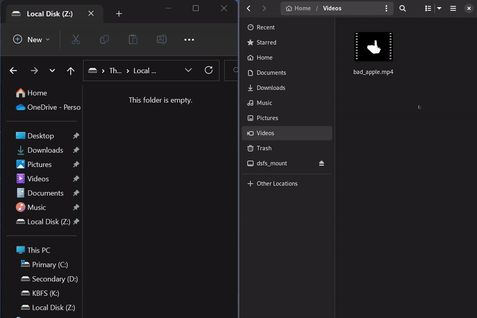

# dsfs

An experimental Filesystem in USErspace (FUSE) with Discord attachments
using [cgofuse](https://github.com/winfsp/cgofuse).

> :warning: **Use at your own risk!** This is an unfinished project and only
> for research or recreational purposes only.

Files are backed on Discord with a very primitive append-only filesystem.

This is considered pre-alpha software and there will be bugs pertaining to
synchronization and functionality.



Here is a blog post going over some implementation
details: [FUSEing for fun](https://www.darenliang.com/posts/fuseing-for-fun)

## Building

Go 1.18+ is required due to the use of generics.

### Windows cgo

Prerequisites: [WinFsp](https://github.com/winfsp/winfsp),
gcc (e.g. from [Mingw-builds](http://mingw-w64.org/doku.php/download))

```
set CPATH=C:\Program Files (x86)\WinFsp\inc\fuse
go build
```

### Windows !cgo

Prerequisites: [WinFsp](https://github.com/winfsp/winfsp)

```
set CGO_ENABLED=0
go build
```

### macOS

Prerequisites: [FUSE for macOS](https://osxfuse.github.io),
[command line tools](https://developer.apple.com/library/content/technotes/tn2339/_index.html)

```bash
go build
```

### Linux

Prerequisites: libfuse-dev, gcc

```bash
go build
```

## Usage

A drive letter is chosen for Windows if the mount point is not provided.

To run:

```bash
dsfs -t <Bot token> -s <Server ID> -m <Mount point>
```

To run with user token:

```bash
dsfs -t <Bot token> -s <Server ID> -m <Mount point> -u
```

To run with transaction compaction:

```bash
dsfs -t <Bot token> -s <Server ID> -m <Mount point> -c
```

To run with FUSE options:

```bash
dsfs -t <Bot token> -s <Server ID> -m <Mount point> -o <FUSE option>
```

## Common fixes to issues

- If you are using a bot token, you must allow the Message Content Intent for
  your bot in the [Discord Developer Portal](https://discord.com/developers/applications).
- If you are having problems with realtime file synchronization, make sure you
  are using a different token for each instance of dsfs.
- If you are experiencing slow startup times, try using the `-c` flag to
  compact transactions.
- If you are using Windows and encountering errors with FUSE, try
  updating [WinFsp](https://github.com/winfsp/winfsp) to the latest version.
